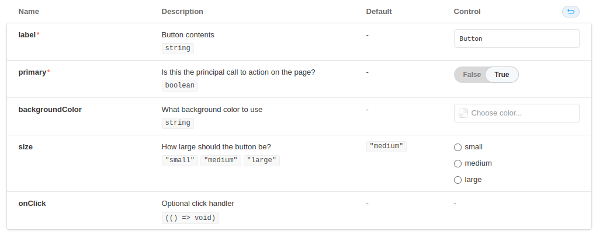

# Modificando controles 


Digamos que tenha um componente que tenha `backgroundColor` como props e essa é do tipo string.
Devido backgroundColor ser desse tipo, na hora de mostrar os controles desse componente, será um campo string


Entretanto, é mais interessante que este campo seja um seletor de cor. E para mudar isso basta:
```tsx
export default {
  title: 'Button',
  component: Button,
  argsType:{
    backgroundColor: {
        control:{
            type: "color"
        }
    }
  }
} as ComponentMeta<typeof Button>;
```

Agora temos um seletor de cor ao invés de um campo string :)


Os controles podem ser redefinidos para quasqueir props e há [uma lista na documentação oficial do Storybook](https://storybook.js.org/docs/react/essentials/controls#annotation) de como mudar tais controles

## Explicando a props de sua story

Caso seja desejável ter uma explicação maior o que tal props representa, podemos comentar na props do component e automaticamente o addon de controls mostrará o mesmo comentário no controle daquela props

Por exemplo:
```tsx title="Component.tsx"
type PropsType = {
	/**
	 * Is this the principal call to action on the page?
	 */
	primary: boolean;
	/**
	 * What background color to use
	 */
	backgroundColor?: string;
	/**
	 * How large should the button be?
	 */
	size?: "small" | "medium" | "large";
	/**
	 * Button contents
	 */
	label: string;
	/**
	 * Optional click handler
	 */
	onClick?: () => void;
};
```
Terá como resultado:



## Mapeando valores complexos 

Alguns valores complexos, como elementos JSX não vão funcionar no addon de controle como esperado. 
Por exemplo, o componente Button pode ter como children outros componentes como Text.
Se nossa primeira story desse componente utilizarmos Text como children, o controle gerado será dessa forma:


Observa-se que não é muito intuitivo mexer com esses valores.
Para resolver esse problema, podemos usar mapeamento da props children. Funciona da seguinte forma:

```tsx title="MyComponent.stories.tsx"
export default {
	title: "Atoms/Button",
	component: Button,
	argTypes: {
		children: {
			options: ["TextWhite", "TextTheme"],
			defaultValue: (
				<Text
					size="t4"
					tabletSize="t3"
					phoneSize="t2"
					color="$colors$color-white-solid"
					isStrong
				>
					Label
				</Text>
			),
			mapping: {
				TextWhite: (
					<Text
						size="t4"
						tabletSize="t3"
						phoneSize="t2"
						color="$colors$color-white-solid"
						isStrong
					>
						Label
					</Text>
				),
				TextTheme: (
					<Text
						size="t4"
						tabletSize="t3"
						phoneSize="t2"
						color="$colors$color-primary-theme-500"
					>
						Label
					</Text>
				),
			},
		},
	},
} as ComponentMeta<typeof Button>;
```

Agora com o children mapeado, podemos utilizar de um select com as opções `TextWhite` e `TextTheme`, e dessa forma controlamos melhor o children.


